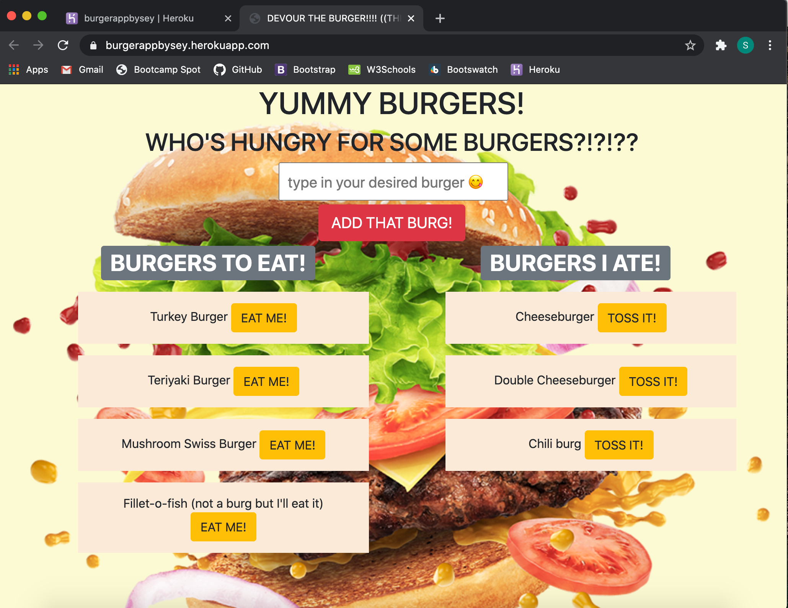

# Burger Devouring App

[](https://opensource.org/licenses/MIT)

## Description

A heroku deployed application that allows a user to create a burger logger that uses MySQL, Node, Express, Handlebars, and a homemade ORM following a Model View Controller design pattern. 

Users input their desired burger and it will pop up in the left column to be able to get devoured and move to the right columb which can then be clicked to be removed. 

Anything that a user is typed into the main input box is created within the database to be saved.

Inside the config folder, a homemade orm is designed to be able to communicate with the burger model and controller to handle any query that is being commanded by the user and relay information and display output appropriately.

## Screenshot Preview


## Installation

In your terminal within the folder directory...
```
npm install mysql express express-handlebar --save
```

Onces all the modules are installed ...
```
node server.js
```

*** 
Identically.. If application is deployed on heroku:
```
open chrome browser and go to https://burgerappbysey.herokuapp.com/
```

## Usage

* While running the app
    - User can write a new burger desired in the input box
    - Burger is saved in the database created for the application
    - Burger is posted on the left column to be eaten
    - Once, clicked to be eaten burger moved to the rigth hand column thats already devoured
    - After displaying on the right, user can click to toss the burger away 
    - Burger is then removed from the database


## Attributes

* jQuery
* Bootstrap framework
* NodeJS
* dotenv
* Express.js
* Express-handlebars
* MySQL
* JawsDB
* Heroku

## License

MIT License

## Links
<a href="https://burgerappbysey.herokuapp.com/" target="_blank">Deployed App on Heroku</a>


---
Copyright Ⓒ 2020 Seychelle Koplik
